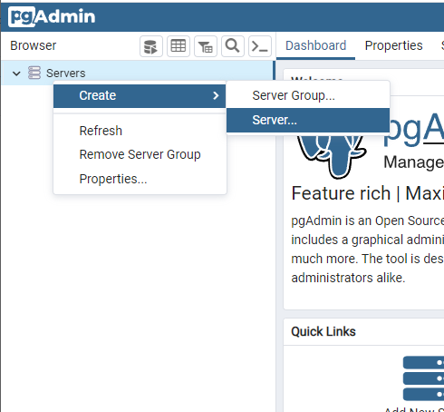
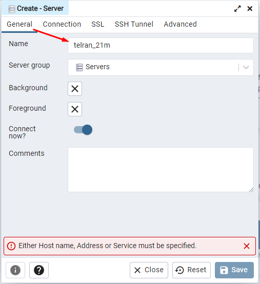
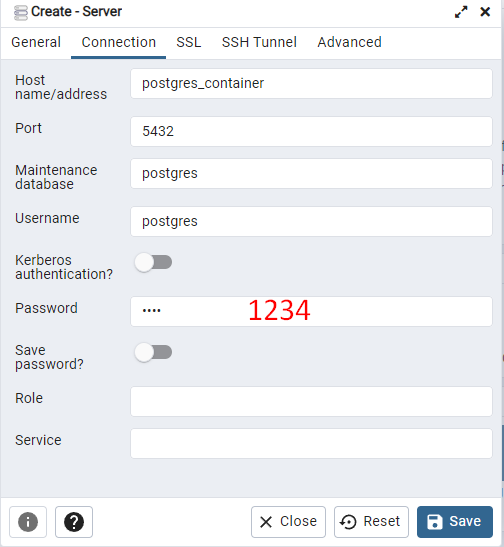
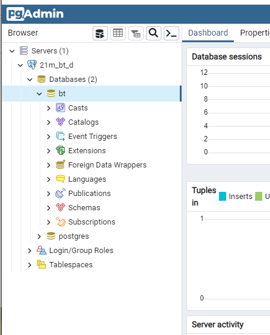

# Docker

To start PostgresSQL and PgAdmin with docker run the in this directory command:
```ssh
docker-compose up
```
> Connect to PostgresSQL with port <b>5433</b> <i>(Port 5432 inside the container)</i>

```
... src/main/resourcesapplication.properties

spring.datasource.driver-class-name=org.postgresql.Driver
spring.datasource.url=jdbc:postgresql://localhost:5432/bt
spring.datasource.username=postgres
spring.datasource.password=1234
...
`````

> To change password or username edit docker-compose.yml

##PgAdmin
### Connect to DB
Follow the link http://localhost:5050 to start PgAdmin.
Use the admin@admin.com for the email address and pass as the password to log in.

Click Servers > Create > Server to create a new server.
<br>

<br>
Select the General tab, set any name 
> for example: 21m_bt_db


<br>
Move to the Connection tab.
Set value into fields host and password:
```
Host: postgres_container
Password: 1234
```
Click save
<br>


<br>
You are connected. 
<br>

<br>
